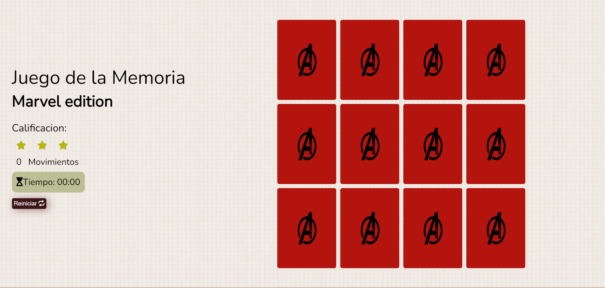

<h1 align="center">Juego de la Memoria - Edicion "Marvel"</h1>

Un juego retro basado en grillas creado en JavaScript vanilla, con HTML y CSS.

## <h2 align="center"></h2>

## Tecnologias Usadas

### Lenguajes Usados

- [HTML5](https://en.wikipedia.org/wiki/HTML5)
- [CSS3](https://en.wikipedia.org/wiki/Cascading_Style_Sheets)
- [JavaScript](https://en.wikipedia.org/wiki/JavaScript)

### Frameworks, Librerias y Programas Usados

1. [Google Fonts:](https://fonts.google.com/)
   - Google fonts fue utilizado para importar la fuente "Nunito" en el html y css.
1. [Font Awesome:](https://fontawesome.com/)
   - Font Awesome fue utilizado para añadir iconos que fueran utiles para la aplicacion.
1. [Git:](https://git-scm.com/)
   - Git fue utilizado para controlar las versiones usando la terminal para hacer Commits en Git y Push a GitHub.
1. [GitHub:](https://github.com/)
   - GitHub es utilizado para almacenar los codigos del proyecto luego del Push de Git.

### Funciones propias de JavaScript en las que me enfoque:
- for loops
- funciones
- operadores ternarios
- setTimeOut
- add/remove classList
- manejo del DOM: document.QuerySelector, document.GetElementByID e innerHTML
